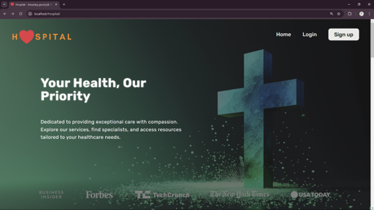
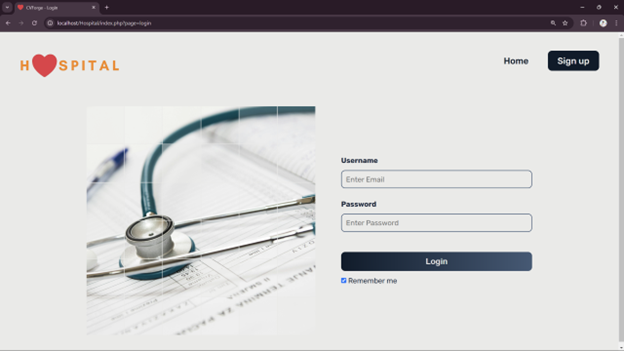
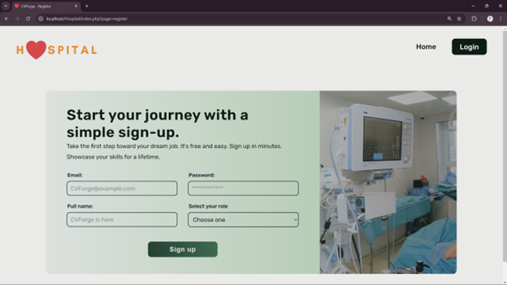
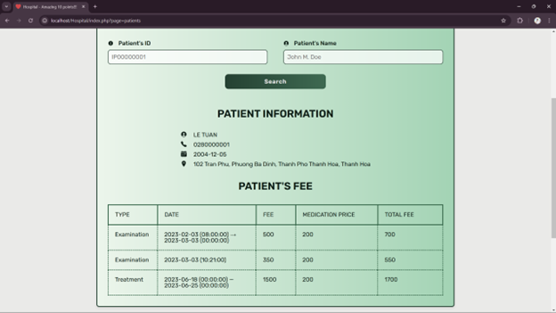

# Hospital Management System  

This project is a web-based Hospital Management System developed as part of the **Database System (CO2013)** course. It provides functionality for managing patient data, doctor assignments, and treatment payment records. The database design is supported by an **Enhanced Entity-Relationship Diagram (EERD)** and **Relational Schema**, included as accompanying files.  

## Features  

### Authentication
- **Log In/Log Out**:  
  - Managers can log in using a username and password.  
  - Securely log out to end the session.  

### Hospital Database Management
1. **Search Patient Information**:  
   - Search by patient details.  
   - Results include the patient’s name, phone number, and treatment/visit history.  

2. **Add New Patient**:  
   - Add detailed information for a new patient into the database.  

3. **List Patients Treated by a Doctor**:  
   - View all patients assigned to a specific doctor.  

4. **Generate Payment Reports**:  
   - Create detailed reports of payments for each treatment or examination for a patient.  

## Database Design  

The system is supported by a robust database design, including:  
- **EERD**: Visual representation of entities, attributes, and relationships.  
- **Relational Schema**: Detailed mapping of the database structure.  

Both files are provided as **HTML documents** for reference.  

## Development Environment  

- **Frontend**: HTML, CSS, JavaScript  
- **Backend**: PHP  
- **Database**: MySQL  

## Usage Instructions  

1. **Manager Authentication**:  
   - Navigate to the login page.  
   - Enter the manager’s username and password to log in.  

2. **Hospital Database Management**:  
   - **Search Patient Information**: Use the search feature to find patient details.  
   - **Add New Patient**: Fill in the form and submit to add a new patient.  
   - **List Patients by Doctor**: Select a doctor to view a list of their patients.  
   - **Generate Payment Reports**: Access reports that detail payments for each patient’s treatments.  

3. **Log Out**:  
   - Use the logout option to end the session securely.  

## Screenshots  

- **Home Page**  
  

- **Login Page**  

- **Register Page**  
    

- **Payment Report**  
    

---  

Feel free to explore, extend, and enhance the system functionality!  
